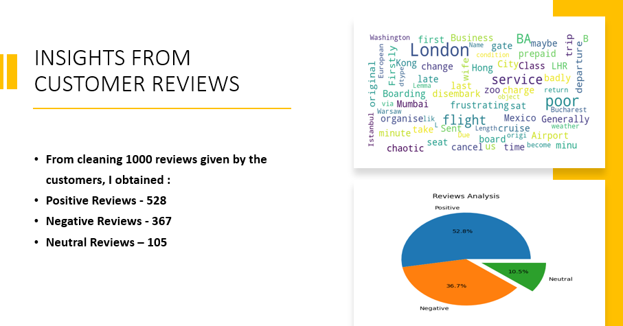

# British Airways Customer Reviews Sentiment-Analysis
British Airways (BA) is the flag carrier airline of the United Kingdom (UK). Every day, thousands of BA flights arrive to and depart from the UK, carrying customers across the world. Customers who book a flight with BA will experience many interaction points with the BA brand. Understanding a customer's feelings, needs, and feedback is crucial for any business, including BA.

# Project Objective

Scraping and collecting customer feedback and reviewing data from a third-party source (Skytrax) and analysing this data to present any insights I may uncover.

# dataset

*    Scraped from Skytrax (Skytrax is a United Kingdom-based consultancy that runs an airline and airport review and ranking site).
*    The data isn't labelled and contains only one column  which is reviews.

# Project Pipeline

*   Scraping and collecting customer feedback .
*   Cleaning the text , Tokenization , Stopwords removal , Enrichment – POS tagging and Lemmatization.
*   Sentiment Analysis using VADER.

# Communicate Results

